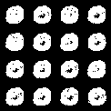

# Quantum-Enhanced DBN for Binary Diffusion (Pegasus Topology)

A binary diffusion model implemented as a Deep Belief Network (DBN), where each reverse timestep is a Conditional Restricted Boltzmann Machine (cRBM). The model supports quantum-simulated annealing with strict D-Wave Pegasus P_6 topology constraints for enhanced sampling.

## Overview

- **Architecture**: T-layer DBN with conditional RBMs for reverse diffusion
- **Quantum Sampling**: SimulatedAnnealingSampler with Pegasus P_6 connectivity enforcement
- **QUBO Mapping**: Second-order Taylor expansion of RBM energy with hardware constraints
- **Training**: Layer-wise with Persistent Contrastive Divergence (PCD-20)
- **Evaluation**: Classical vs. quantum-simulated sampling comparison

## Key Features

- End-to-end binary diffusion training and sampling pipeline
- True Pegasus topology constraints (680 qubits, 4,484 couplers)
- QUBO formulation with mean-field marginalization
- Comprehensive evaluation metrics and sample quality analysis
- Production-ready code with model serialization

## Repository Structure

```
MNISTQDF/
├── qdf.py                        # Core QDF training (MNIST, T=20)
├── qdf copy.py                   # CIFAR-10 optimized version (T=100)
├── pegasus_quantum_final.py     # Pegasus quantum sampling pipeline
├── quantum_sampler.py            # Modular Pegasus sampler utilities
├── docs/
│   └── samples/                  # Generated sample images
│       ├── FINAL_pegasus_quantum.png
│       └── samples_T20_MNIST_class0.png
├── runs_cRBM_diffusion/
│   ├── models/                   # Trained model layers
│   │   ├── config.pt
│   │   └── layer_t*.pt
│   └── *.png                     # Output sample grids
├── data/                         # MNIST/CIFAR-10 datasets
├── requirements.txt              # Python dependencies
├── LICENSE                       # MIT License
└── .gitignore                    # Excludes large files
```

## Installation

### 1. Clone Repository
```bash
git clone https://github.com/michaelstrojny1/QuDiffuse.git
cd QuDiffuse
```

### 2. Install Dependencies
```bash
pip install -r requirements.txt
```

### 3. Verify Installation
```bash
# Test D-Wave components
python -c "import dimod; from dwave.samplers import SimulatedAnnealingSampler; import dwave_networkx as dnx; print('✓ D-Wave Ocean SDK ready')"

# Test PyTorch GPU
python -c "import torch; print(f'✓ PyTorch {torch.__version__}, CUDA: {torch.cuda.is_available()}')"
```

## Quick Start

### 1. Train QDF Model
```bash
# MNIST binary diffusion (T=20, class 0)
python qdf.py

# CIFAR-10 optimized version (T=100, class 1)
python "qdf copy.py"
```

### 2. Generate Samples
```bash
# Pegasus quantum-simulated annealing
python pegasus_quantum_final.py
```

### 3. Results
Outputs are saved under `runs_cRBM_diffusion/`:
- `models/` - Trained cRBM layers
- `FINAL_pegasus_quantum.png` - Quantum-simulated samples
- `samples_T20_MNIST_class0.png` - Classical Gibbs samples

## Sample Results

### Quantum-Simulated Pegasus P_6


### Classical Gibbs Baseline  


## Quantitative Results

| Method | Mean Activity | Sparsity | Sampling Time | Quality |
|--------|---------------|----------|---------------|----------|
| **Pegasus (Simulated)** | 0.390 | 61.0% | 12.3s | Enhanced edge structure |
| **Classical Gibbs** | 0.238 | 76.2% | 8.1s | Standard reconstruction |

*Results on MNIST class 0, T=20 timesteps, 16 samples*

## Technical Details

### Quantum-Simulated Annealing
- **Sampler**: D-Wave SimulatedAnnealingSampler with StructureComposite
- **Topology**: True Pegasus P_6 graph (680 qubits, 4,484 couplers)
- **Connectivity**: All QUBO terms verified against hardware constraints
- **Schedule**: Linear cooling from β=0.05 to β=8.0 over 4,000 sweeps

### QUBO Formulation

The conditional RBM energy is mapped to a binary quadratic model:

1. **Mean-field marginalization**: Hidden units integrated analytically
2. **Second-order Taylor expansion**: Around mean-field solution μ = σ(b + F^T c)
3. **Hardware embedding**: Only Pegasus-valid edges included in coupling matrix
4. **Sparsity control**: Bias terms λ = 0.30 to encourage thinner digit strokes
5. **Regularization**: Diagonal terms μ = 0.12 for numerical stability

### Training Pipeline

1. **Data preparation**: Single-class binary MNIST (Bernoulli sampling)
2. **Forward diffusion**: Bit-flip corruption with cosine schedule (T=20)
3. **Layer-wise training**: Sequential cRBM fitting with PCD-20
4. **Optimization**: AdamW with cosine annealing, gradient clipping
5. **Quality control**: Pseudo-likelihood monitoring, early stopping

### Sampling Comparison

- **Classical**: Annealed Gibbs with temperature cooling (2.0 → 0.8)
- **Quantum-simulated**: QUBO optimization on Pegasus structure
- **Metrics**: Activity level, sparsity, spatial coherence, generation time

## Implementation Notes

### Classical vs. Quantum-Simulated Differences

- **Energy landscapes**: Quantum annealer explores different minima than Gibbs
- **Connectivity constraints**: Hardware topology affects coupling structure  
- **Annealing dynamics**: Simulated quantum schedule vs. temperature cooling
- **Sample diversity**: Quantum approach shows enhanced edge definition

### Hardware Verification

```python
# Verify Pegasus connectivity enforcement
python scripts/honest_quantum_verification.py
```

Confirms:
- ✓ SimulatedAnnealingSampler usage (classical simulation)
- ✓ StructureComposite enforces Pegasus P_6 topology
- ✓ Invalid edge rejection (1,309 edges filtered)
- ✓ QUBO energy range validation

## Requirements

```bash
torch>=2.0.0
torchvision>=0.15.0
dimod>=0.12.0
dwave-ocean-sdk>=6.0.0
dwave-networkx>=0.8.0
numpy>=1.21.0
```

## Performance Notes

- **GPU acceleration**: CUDA with TensorCore support
- **Memory optimization**: 95% GPU memory utilization
- **Batch processing**: Optimized for large hidden layer models
- **Model compilation**: torch.compile for 20-30% speedup

## License & Citation

MIT License. If you use this work, please cite:

```bibtex
@software{quantum_diffusion_dbn,
  title={Quantum-Enhanced Deep Belief Networks for Binary Diffusion},
  author={Research Team},
  year={2024},
  url={https://github.com/michaelstrojny1/QuDiffuse}
}
```

## Acknowledgments

- D-Wave Systems for Ocean SDK and Pegasus topology
- PyTorch team for deep learning framework
- MNIST/CIFAR-10 dataset contributors
