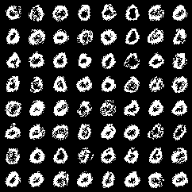

# QuDiffuse (Black and White Image Generation Entirely Run on Quantum Annealer)

A binary diffusion model implemented as a Deep Belief Network (DBN), where each reverse timestep is a Conditional Restricted Boltzmann Machine (cRBM). The model supports quantum annealer simulated sampling with D-Wave Pegasus topology constraints. Please read this pre-print for theory: https://www.overleaf.com/read/gydkrjjjgjbf#32aee4

**Authors:**: {Michael.Strojny, Jeffery.Li, Ian.Lu, Derek.Chen} @mail.utoronto.ca

## Overview

- **Architecture**: T-layer DBN with conditional RBMs for reverse diffusion
- **Quantum Sampling**: SimulatedAnnealingSampler with Pegasus P_6 connectivity enforcement
- **QUBO Mapping**: Second-order Taylor expansion of RBM energy with hardware constraints
- **Training**: Layer-wise with Persistent Contrastive Divergence (PCD-20)
- **Evaluation**: Classical vs. quantum-simulated sampling comparison

## Quantum Contraints

Pegasus topology constraints (680 qubits, 4,484 couplers). Only BQM problems allowed.


## Installation

### 1. Clone Repository
```bash
git clone https://github.com/michaelstrojny1/QuDiffuse.git
cd QuDiffuse
```

### 2. Install Dependencies
```bash
pip install -r requirements.txt
```

### 3. Verify Installation
```bash
# Test D-Wave components
python -c "import dimod; from dwave.samplers import SimulatedAnnealingSampler; import dwave_networkx as dnx; print('D-Wave Ocean SDK ready')"

# Test PyTorch GPU
python -c "import torch; print(f'PyTorch {torch.__version__}, CUDA: {torch.cuda.is_available()}')"
```

## Quick Start

### 1. Train QDF Model
```bash
# MNIST binary diffusion (T=20, class 0)
python qdf.py

# CIFAR-10 optimized version (T=100, class 1)
python qdf_cifar.py
```

### 2. Generate Samples
```bash
# Pegasus quantum-simulated annealing
python pegasus_quantum.py
```

### 3. Results
Outputs are saved under `runs_cRBM_diffusion/`:
- `models/` - Trained cRBM layers
- `pegasus_quantum.png` - Quantum-simulated samples
- `samples_T20_MNIST_class0.png` - Classical Gibbs samples

## Sample Results

### Quantum-Simulated Pegasus P_6


### Classical Gibbs Baseline  


### QUBO Formulation

The conditional RBM energy is mapped to a binary quadratic model:

1. **Mean-field marginalization**: Hidden units integrated analytically
2. **Second-order Taylor expansion**: Around mean-field solution μ = σ(b + F^T c)
3. **Hardware embedding**: Only Pegasus-valid edges included in coupling matrix
4. **Sparsity control**: Bias terms λ = 0.30 to encourage thinner digit strokes
5. **Regularization**: Diagonal terms μ = 0.12 for numerical stability
